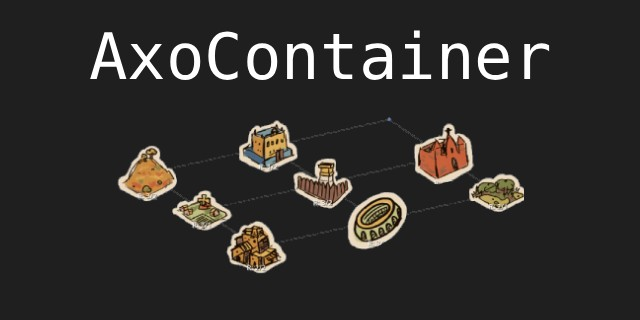
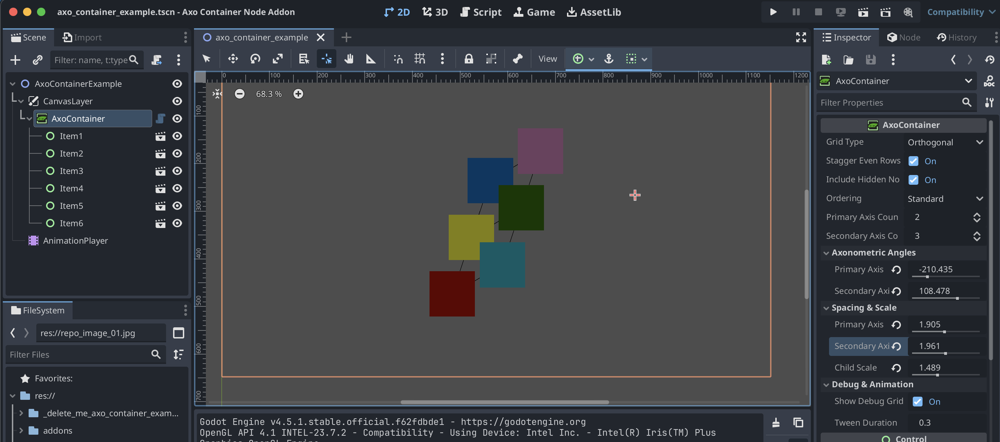
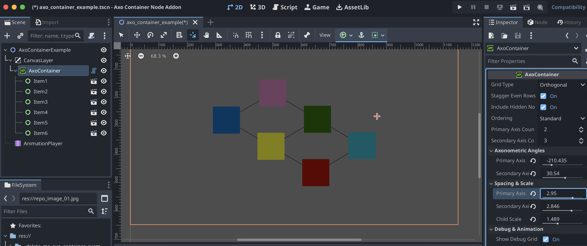

# AxoContainer 0.5 for Godot 4.5.1 (stable)

A specialized custom UI Container designed for **Axonometric**, **Isometric**, layouts. Unlike standard grid containers, `AxoContainer` projects children along two custom angular axes, allowing for stylized menus, tactical grids, and isometric inventory systems.

<div align="center">
	
</div>


## Features
* **Dual-Axis Transformation:** Define independent angles for Primary and Secondary axes to achieve any axonometric skew.
* **Staggered (Brick) Type:** Toggle between orthogonal alignment and a staggered layout (where specific rows are offset by 0.5 units and reduced in capacity).
* **Flexible Ordering Logic:** Choose how children fill slots: `STANDARD`, `SPIRAL` (center-out), `REVERSE`, or `BOTTOM_UP`.
* **Hidden Node Awareness:** Toggle `include_hidden_nodes` to decide if invisible children should hold their grid position or be skipped.
* **Editor Debugging:** Real-time visualization of the grid structure with color-coded slots (Red: Occupied, Blue: Empty).

---

## Layout Properties

### Layout Settings
- **Grid Type**: Switch between `ORTHOGONAL` (standard) and `STAGGERED` (brick).
- **Stagger Even Rows**: In Staggered mode, determines if even (0, 2...) or odd (1, 3...) rows get the 0.5 unit offset and lose a point.
- **Include Hidden Nodes**: If true, `visible = false` nodes still consume a grid slot.
- **Ordering**: The sequence logic for how children fill the available points.
- **Primary/Secondary Axis Count**: The dimensions of the grid.

### Axonometric Angles
- **Primary Axis Angle**: The direction in degrees for the first axis (columns).
- **Secondary Axis Angle**: The direction in degrees for the second axis (rows).

### Spacing & Scale
- **Axis Spacing**: Distance multipliers based on the first child's minimum size. Use values < 1.0 to overlap items.
- **Child Scale**: A uniform scale override applied to all children to maintain visual consistency.

---

## Usage Example: Dynamic Generation

You can populate the container via code. The container will automatically re-sort and animate children to their designated positions as they are added.

```gdscript
extends Node2D

@onready var axo_container = $AxoContainer

func _ready():
	# Dynamically fill the grid with 10 panels
	for i in range(10):
		create_ui_item(i)

func create_ui_item(index: int):
	var panel = Panel.new()
	panel.custom_minimum_size = Vector2(80, 80)
	
	# Adding as a child automatically triggers the AxoContainer sort logic
	axo_container.add_child(panel)
	
	# Adding a label for identification
	var label = Label.new()
	label.text = str(index)
	panel.add_child(label)
```

## Screenshots

**Using it for some colored blocks**


**Modified settings**


**In motion, for some cool pictures**
